# Opvolgtool taken

Een tool voor leerkrachten om taken van leerlingen bij te houden en op te volgen wanneer die niet in orde zijn. In het **docentscherm** zie je per leerling en per taak de status. Leerlingen en ouders zien hun eigen overzicht via een link, of in een elektronische leeromgeving (ELO) zoals Smartschool.

---

## Inhoud

- [Wat doet de tool?](#wat-doet-de-tool)
- [Schermen](#schermen)
- [Eerste keer opzetten](#eerste-keer-opzetten)
- [De twee implementaties](#de-twee-implementaties)
- [Beveiliging en privacy](#beveiliging-en-privacy)
- [Na elke codewijziging](#na-elke-codewijziging)
- [Dagelijks gebruik](#dagelijks-gebruik)
- [Licentie](#licentie)

---

## Wat doet de tool?

**Als leerkracht** open je het docentscherm. Op een computer zie je een kruistabel: leerlingen × taken. Op de telefoon werk je via twee tabbladen: **Leerling** en **Taak**. Je vult per taak in of iets in orde is, niet in orde, te laat, nog te maken, enzovoort. Via de leerlingfiche (klik of tik op een naam) zie je hetzelfde overzicht als de leerling, plus de persoonlijke code en de link die je met leerling of ouders deelt.

Als een leerling een drempel haalt (standaard 3× niet in orde), volg je een vaste ladder: leerling aanspreken → ouders verwittigen → avondstudie → evaluatie. Blijven taken open, dan zet je de leerling **Aan zet**: de verantwoordelijkheid ligt bij de leerling tot de lijst in orde is.

**Als leerling of ouder** open je die link, of het overzicht in Smartschool / het leerlingvolgsysteem. Je ziet de taken en statussen van die ene leerling. Iedereen met die link kan de pagina bekijken — daarvoor hoef je niet in te loggen.

---

## Schermen

### Telefoon

Op een smal scherm zie je geen kruistabel, maar twee tabbladen.

**Leerling** — overzicht van de klas. Tik een naam om taken af te vinken.

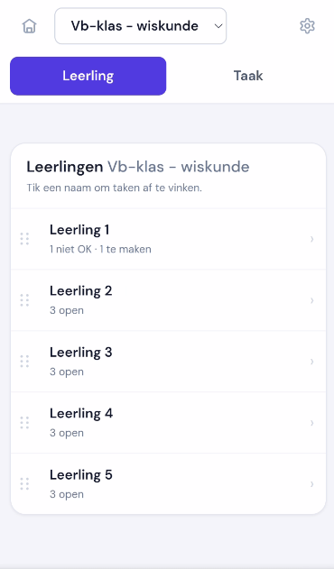

Na het tikken van een naam: taken van die leerling, met statusknoppen.

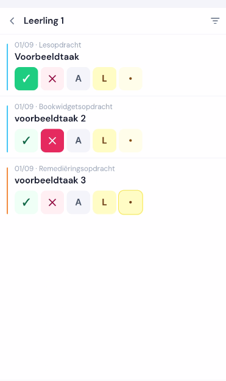

**Taak** — overzicht van de taken. Tik een taak om de klas af te vinken.

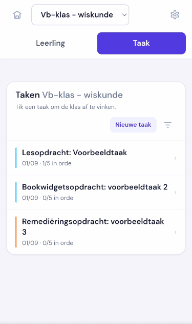

Na het tikken van een taak: status per leerling, inclusief lege vakjes in één keer.

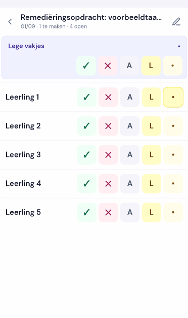

### Computer

Op een breed scherm is de kruistabel de hoofdweergave: rijen zijn leerlingen, kolommen zijn taken.

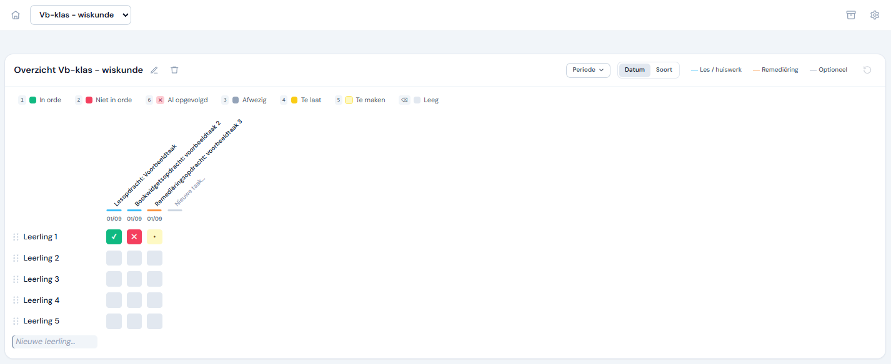

De leerlingpagina kun je in het dossier zetten (Smartschool of een ander leerlingvolgsysteem), als een ingesloten venster (iframe).

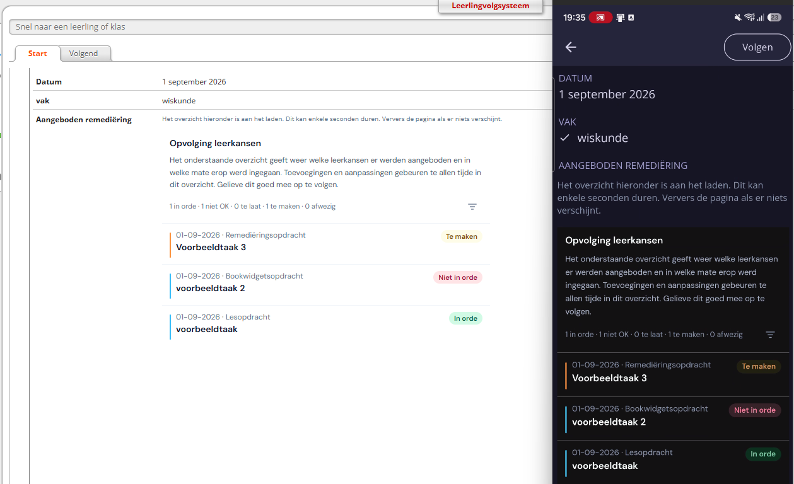

### Opvolging

Haalt een leerling de drempel (standaard 3× niet in orde), dan opent de fiche een opvolgbalk.

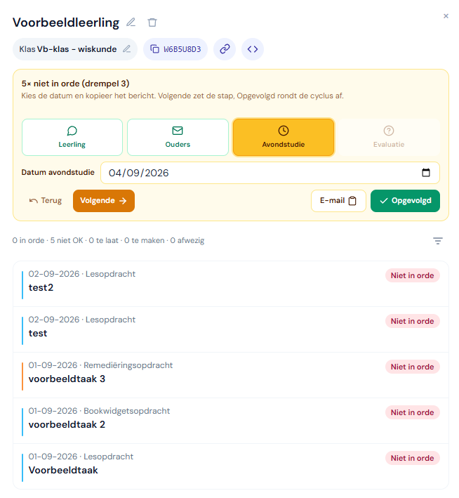

De vier stappen:

| Stap | Wat je doet |
|---|---|
| Leerling | Spreek de leerling aan en kopieer eventueel het bericht |
| Ouders | Kopieer het bericht naar de ouders |
| Avondstudie | Kies de datum en kopieer het bericht |
| Evaluatie | **Aan zet** als de taken nog openstaan, **Opgevolgd** om de cyclus af te ronden |

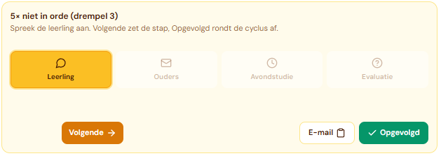

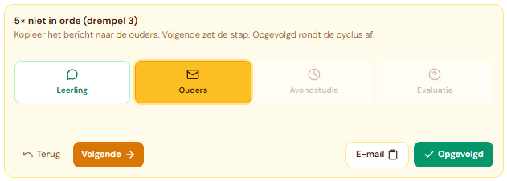

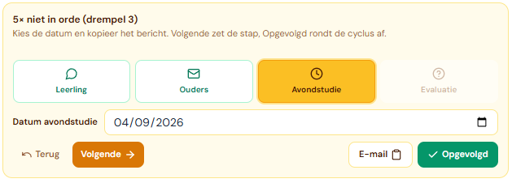

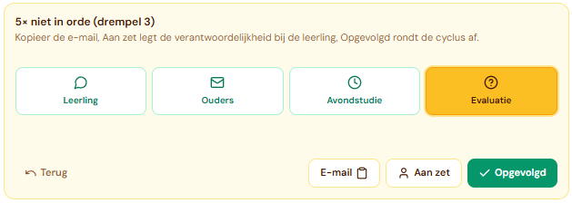

Bij **Aan zet** kopieer je een e-mail naar leerling en ouders. In het leerlingscherm verschijnt bovenaan een melding tot alle openstaande taken in orde of opgevolgd zijn. Nieuwe tekorten starten geen nieuwe cyclus.

In de kruistabel is **Opgevolgd** (toets 6) het lichtrode kruisje: de taak telt niet meer mee voor een volgende cyclus. Intern blijft de status `Al opgevolgd`.

---

## Eerste keer opzetten

Je zet de tool één keer klaar in Google. De gegevens (leerlingen, taken, statussen) bewaart ze in een **Google Sheet**. Jij maakt alleen de lege structuur; daarna schrijft de tool zelf in die Sheet. Het dagelijkse werk blijft in het docentscherm (tabblad: *Opvolgtool taken*).

Aan die Sheet hang je de code uit dit project (een **Apps Script**). Tot slot publiceer je twee web-apps: één om te bewerken, één om te bekijken.

### 1. Google Sheet aanmaken (alleen de structuur)

Maak een nieuwe Google Sheet. Voeg vijf tabbladen toe met **exact** deze namen (hoofdlettergevoelig):

| Tabblad | Wat de tool erin bewaart |
|---|---|
| `Leerlingen` | Namen, klas, persoonlijke code, opvolging |
| `Taken_Lijst` | Taken (naam, soort, deadline, klas) |
| `Registraties` | Status per leerling per taak |
| `Klassen` | Klassen en vak |
| `Instellingen` | Drempel, berichten, periodes |

**Rij 1** van elk tabblad krijgt alleen koppen. De volgorde van de kolommen is verplicht (de code leest op positie, niet op de tekst van de kop). Typ daaronder **niets**. Geen leerlingen, geen taken, geen voorbeelden.

| Tabblad | Koppen in rij 1, van links naar rechts |
|---|---|
| `Leerlingen` | `id` · `naam` · `klas` · `code` · `geschraptIn` · `klasSinds` · `verwijderdOp` · `opvolgingLeerlingOp` · `opvolgingOudersOp` · `opvolgingNablijfOp` · `opvolgingResetOp` · `opvolgingGepauzeerd` · `opvolgingBlokkeerTaken` · `volgorde` |
| `Taken_Lijst` | `id` · `naam` · `type` · `deadline` · `klas` |
| `Registraties` | `datumTijd` · `llnId` · `taakId` · `status` · `opmerking` · `klas` |
| `Klassen` | `naam` · `vak` |
| `Instellingen` | `sleutel` · `waarde` |

In `Instellingen` schrijft de tool zelf o.a. `opvolgingAan`, `opvolgingDrempel`, `berichtLeerling`, `berichtOuders`, `berichtNablijf`, `berichtAanZet` en `periodes`.

Klaar. Vanaf hier vult de tool de rijen zelf. Leerlingen, taken en statussen voeg je later toe in het docentscherm.

Deel de Sheet **niet** via “iedereen met de link”. Alleen wie het script beheert (en eventueel een collega-beheerder) heeft de Sheet nodig.

---

### 2. Script koppelen

1. Open de Sheet → **Uitbreidingen → Apps Script**
2. Verwijder de lege `Code.gs` en plak de inhoud uit dit project
3. Voeg ook `Config.gs` en `LeerlingCodes.gs` toe (zelfde namen)
4. Maak deze HTML-bestanden aan. In de editor is de naam **zonder** `.html`. Plak de inhoud uit het gelijknamige bestand in dit project:
   `docent`, `docent-kern`, `docent-opvolging`, `docent-kruis`, `docent-ui`, `leerling`

---

### 3. Wie mag het docentscherm bewerken?

Dit is **alleen** voor het docentscherm: wie leerlingen, taken en statussen mag wijzigen.

Het leerlingscherm hangt hier niet van af. Iedereen met de persoonlijke leerlinglink kan dat overzicht zien, ook zonder dat hun e-mail hier staat en zonder Google-account.

Open `Config.gs` en zet de Google-accounts van de leerkrachten die mogen bewerken:

```javascript
const TOEGANG_EMAIL_DOCENT = [
  'jij@school.be',
  'collega@school.be'
];
```

Kleine en hoofdletters maken niet uit. Wie niet in deze lijst staat, krijgt het docentscherm niet te zien — ook niet via de docent-URL.

---

## De twee implementaties

Zelfde code, twee publicaties, andere toegangsinstellingen. Eerst de docent-web-app, daarna die voor leerlingen.

| | Implementatie A — Docent | Implementatie B — Leerling |
|---|---|---|
| **Voor wie** | Leerkrachten die data mogen wijzigen | Leerlingen en ouders die alleen kijken |
| **Login** | Ja, school-Google-account | Nee |
| **Wie mag openen?** | Alleen adressen in `TOEGANG_EMAIL_DOCENT` | Iedereen met de juiste `?id=CODE`-link |

### Implementatie A — Docent

1. Apps Script → **Implementeren → Nieuwe implementatie** (of een bestaande bewerken)
2. Type: **Web-app**
3. Instellingen:
   - **Uitvoeren als:** Gebruiker die de web-app opent
   - **Wie heeft toegang:** Iedereen met een Google-account
4. Implementeren en de URL bewaren

*Uitvoeren als de bezoeker* is nodig zodat het script het echte schoolaccount ziet en kan toetsen aan de e-maillijst. *Iedereen met een Google-account* betekent niet dat iedereen mag bewerken: wie niet in de lijst staat, wordt alsnog geweigerd.

Docent-URL:

```
https://script.google.com/macros/s/.../exec
```

### Implementatie B — Leerling

1. **Implementeren → Nieuwe implementatie** (een tweede web-app, niet A overschrijven)
2. Type: **Web-app**
3. Instellingen:
   - **Uitvoeren als:** Ik (eigenaar van het script)
   - **Wie heeft toegang:** Iedereen
4. Implementeren en de URL bewaren
5. Plak die URL in `Config.gs`:

```javascript
const LEERLING_IMPLEMENTATIE_URL = 'https://script.google.com/macros/s/AKfy.../exec';
```

6. Publiceer **beide** implementaties opnieuw als nieuwe versie. Zo weet de tool welke URL de leerlingpagina is, en blokkeert ze bewerk-functies op die URL.

`SPREADSHEET_ID` in `Config.gs` laat je leeg als het script aan de Sheet hangt. Alleen bij een losstaand script vul je het spreadsheet-ID in.

*Uitvoeren als ik* laat de pagina de Sheet lezen zonder dat de bezoeker de Sheet zelf mag openen. *Iedereen* laat leerlingen en ouders toe zonder Google-account. De code van 8 tekens in de URL is de enige sleutel.

Link per leerling (code staat in de leerlingfiche in het docentscherm):

```
https://script.google.com/macros/s/.../exec?id=AB2CD3EF
```

---

## Beveiliging en privacy

| Wie | Wat ze zien of mogen |
|---|---|
| Leerkracht in de e-maillijst | Docentscherm: alles bekijken en bewerken |
| Iemand met de docent-URL maar zonder adres in de lijst | Geen toegang tot het docentscherm |
| Iedereen met de juiste leerlinglink | Het taakoverzicht van die leerling |
| Iemand met een foute of ontbrekende code | Foutpagina |

De e-maillijst regelt **bewerkingsrecht**, niet of het leerlingscherm bestaat. Dat scherm is bewust publiek via de link, zodat ouders geen schoolaccount nodig hebben.

Deel de link alleen met de betrokken leerling of ouders. Wie de link heeft, kan meekijken.

Verdere aandachtspunten:

- Bewerk-functies controleren altijd het Google-account van de bezoeker
- Op de leerling-URL worden bewerk-functies altijd geblokkeerd
- Deel de Google Sheet zelf nooit via “iedereen met de link”
- Opmerkingen bij taken kunnen persoonsgegevens bevatten
- Registreer de tool in het verwerkingsregister van de school als dat bij jullie hoort

---

## Na elke codewijziging

Als je `Code.gs`, `Config.gs`, `LeerlingCodes.gs` of een van de HTML-bestanden aanpast:

1. **Implementeren → Implementaties beheren**
2. Potlood bij **elke** actieve web-app (A én B)
3. **Versie:** Nieuwe versie → opslaan

De `/exec`-URL blijft hetzelfde. Ververs daarna de pagina.

De **testimplementatie** (`/dev`) toont altijd de laatst *opgeslagen* code, maar alleen voor wie het script mag bewerken. Handig om het docentscherm te proberen. De kopieerknop in de fiche maakt op `/dev` een testlink (`/dev?id=CODE`) van hetzelfde script. De iframe-code blijft de publieke `/exec`-URL van implementatie B — die gebruik je voor Smartschool en ouders.

---

## Dagelijks gebruik

### Docentscherm

- Open de docent-URL en log in met een account uit de e-maillijst
- Maak een klas aan op de startpagina (klas + vak); daarna kies je die klas in de balk
- **Computer — kruistabel:** status per leerling en taak (sneltoetsen 1–6, slepen, periodes filteren)
- **Telefoon — Leerling / Taak:** tik een naam of taak om af te vinken
- **Leerlingfiche:** klik of tik op een naam — zelfde overzicht als de leerling, plus code, link en iframe
- **Taken:** nieuwe taak onderaan de tabel, via *Nieuwe taak*, of via het formulier; soort en datum kun je later nog zetten
- **Opvolging:** bij de drempel de stappen zetten; e-mail kopiëren per stap; bij evaluatie *Aan zet* of *Opgevolgd*
- **Instellingen:** opvolging aan/uit, drempel, de vier standaardberichten (leerling, ouders, avondstudie, aan zet) en periodes

Statussen: In orde · Niet in orde · Opgevolgd · Afwezig · Te laat · Te maken · leeg.

### Leerlingscherm

- Unieke URL met `?id=CODE` — geen login
- Toont alleen taken met een echte status (leeg of gewist verschijnt niet)
- Filter op periode en soort via het filtericoon
- Bij **Aan zet** staat bovenaan een melding tot de openstaande taken in orde of opgevolgd zijn
- Geschikt als iframe in Smartschool of Google Sites:

```html
<iframe
  src="https://script.google.com/macros/s/.../exec?id=AB2CD3EF"
  width="100%"
  height="600"
  frameborder="0">
</iframe>
```

---

## Bestanden (voor wie de code nakijkt)

| Bestand | Rol |
|---|---|
| `Config.gs` | E-mails van bewerkers, leerling-URL, eventueel spreadsheet-ID |
| `Code.gs` | Server: lezen en schrijven in de Sheet |
| `LeerlingCodes.gs` | Formaat en generatie van de 8-tekens codes |
| `docent.html` | Docentscherm: markup en stijl |
| `docent-kern.html` | Data, GAS-koppeling, klassen |
| `docent-opvolging.html` | Opvolgingsladder en berichten |
| `docent-kruis.html` | Kruistabel, selectie, slepen |
| `docent-ui.html` | Lijsten, fiche, instellingen |
| `leerling.html` | Leerlingscherm (via code) |

---

## Licentie

Copyright © 2026 Dennis Tarnaud

De 'Opvolgtool taken' valt onder [CC BY-NC-SA 4.0](https://creativecommons.org/licenses/by-nc-sa/4.0/deed.nl). Scholen en collega’s mogen de code gebruiken en aanpassen, met naamsvermelding. Die naamsvermelding hoort in LICENSE en README, niet in de schermen van de tool. Aanpassingen die je verder deelt, blijven onder dezelfde licentie. Commercieel gebruik is niet toegestaan. Wie toch commercieel wil gebruiken, opent een issue op deze repository.

De software wordt geleverd zoals ze is. Er is geen garantie en geen aansprakelijkheid als er iets misloopt. De volledige tekst staat in [`LICENSE`](LICENSE).
