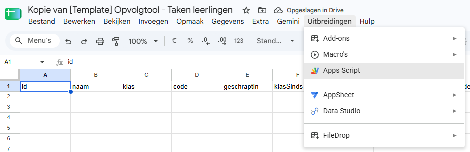
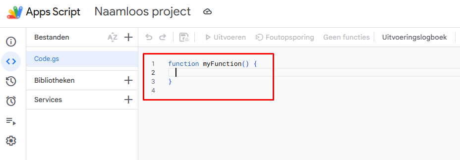
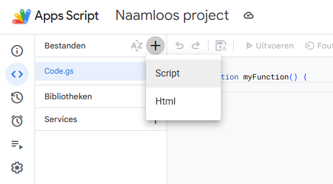
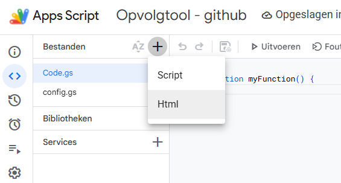
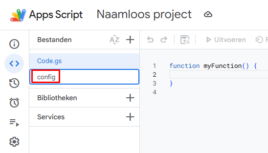
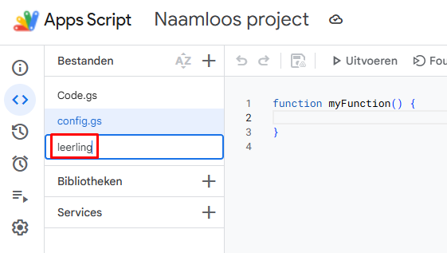
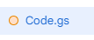
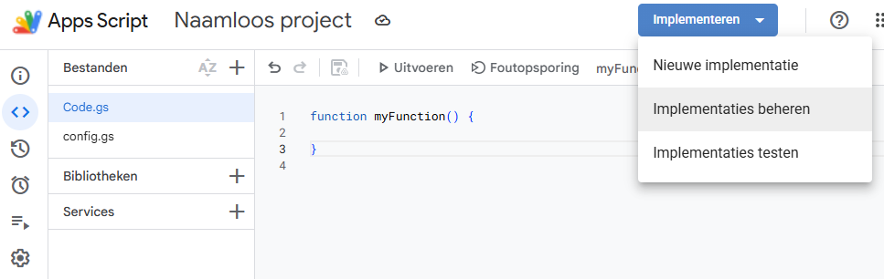
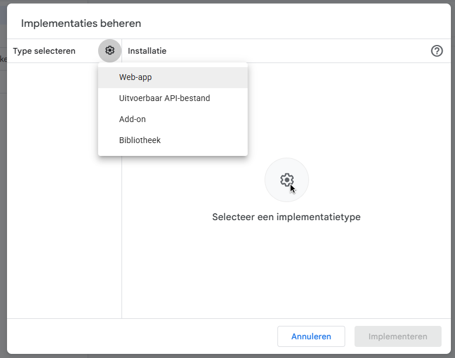

# Opvolgtool taken

Een tool voor leerkrachten om taken van leerlingen bij te houden en op te volgen. In het **docentscherm** zie je per leerling en per taak de status. Leerlingen en ouders zien hun eigen overzicht. Die is meestal ingesloten in de elektronische leeromgeving (ELO), bijvoorbeeld in Smartschool.

---

## Inhoud

- [Wat doet de tool?](#wat-doet-de-tool)
- [Schermen](#schermen)
- [Eerste keer opzetten](#eerste-keer-opzetten)
- [De twee implementaties](#de-twee-implementaties)
- [Beveiliging en privacy](#beveiliging-en-privacy)
- [Na elke codewijziging](#na-elke-codewijziging)
- [Dagelijks gebruik](#dagelijks-gebruik)
- [Licentie](#licentie)

---

## Wat doet de tool?

Je houdt per leerling bij hoe taken zijn afgerond: in orde, niet in orde, te laat, nog te maken, en dergelijke.

Haalt een leerling de drempel (standaard 3× niet in orde), dan volg je een vaste ladder: leerling aanspreken, ouders verwittigen, avondstudie, evaluatie. Blijven taken niet in orde, dan zet je de leerling '**Aan zet**': de verantwoordelijkheid ligt bij de leerling tot de lijst in orde is.

Leerling en ouder zien alleen het overzicht van die ene leerling.

---

## Schermen

### Computer

Op een breed scherm is de kruistabel de hoofdweergave: rijen zijn leerlingen, kolommen zijn taken.


### Telefoon

Op een smal scherm zie je geen kruistabel, maar twee tabbladen.

**Leerling**: overzicht van de klas. Tik op een naam om taken af te vinken.


Na het tikken op een naam: taken van die leerling, met statusknoppen.


**Taak**: overzicht van de taken. Tik op een taak om de leerlingen van de klas af te vinken.


Na het tikken op een taak: status per leerling. Via 'Lege vakjes' vul je alle lege vakjes in één keer in.


### Dossier

Meestal zet je de leerlingpagina in het dossier (Smartschool of een ander leerlingvolgsysteem), als een ingesloten venster (iframe). Dat venster vraagt geen extra login: wie het dossier mag openen in de ELO, ziet het overzicht. De pagina toont de taken van die ene leerling, zonder de naam. De koppeling “dit is die leerling” gebeurt in de ELO, achter die login.


### Opvolging

Haalt een leerling de drempel (standaard 3× niet in orde), dan opent de fiche een opvolgbalk.


De vier stappen:

| Stap | Wat je doet |
|---|---|
| Leerling | Spreek de leerling aan en kopieer eventueel het bericht |
| Ouders | Kopieer het bericht naar de ouders |
| Avondstudie | Kies de datum en kopieer het bericht |
| Evaluatie | '**Aan zet**' als de taken nog openstaan, **Opgevolgd** om de cyclus af te ronden |


Bij '**Aan zet**' kopieer je een e-mail naar leerling en ouders. In het leerlingscherm verschijnt bovenaan een melding tot alle openstaande taken in orde of opgevolgd zijn. Nieuwe tekorten starten geen nieuwe cyclus.

In de kruistabel is **Opgevolgd** (toets 6) het lichtrode kruisje: de taak telt niet meer mee voor een volgende cyclus. Intern blijft de status `Al opgevolgd`.

---

## Eerste keer opzetten

Je zet de tool één keer klaar in Google. De gegevens (leerlingen, taken, statussen) bewaart de tool in een **Google Sheet**. Jij maakt alleen de lege structuur; daarna schrijft de tool zelf in die Sheet. Het dagelijkse werk blijft in het docentscherm (tabblad: *Opvolgtool taken*).

Aan die Sheet hang je de code uit dit project (een **Apps Script**). Tot slot publiceer je twee web-apps: één om te bewerken, één om te bekijken.

### 1. Google Sheet aanmaken (alleen de structuur)

Het snelst: [maak een kopie van de templatesheet](https://docs.google.com/spreadsheets/d/1su54OKbVJrFEeISrP23PN-aGJ6jebnEwn3U1EeySLhY/copy). Die kopie komt in jouw Drive. De tabbladen en koppen staan er al in, de rijen daaronder blijven leeg. Hang er nog geen script aan, dat komt in stap 2.

Je kan het ook zelf opbouwen: maak een nieuwe Google Sheet. Voeg vijf tabbladen toe met **exact** deze namen (hoofdlettergevoelig):

| Tabblad | Wat de tool erin bewaart |
|---|---|
| `Leerlingen` | Namen, klas, persoonlijke code, opvolging |
| `Taken_Lijst` | Taken (naam, soort, deadline, klas) |
| `Registraties` | Status per leerling per taak |
| `Klassen` | Klassen en vak |
| `Instellingen` | Drempel, berichten, periodes |

**Rij 1** van elk tabblad krijgt alleen koppen. De volgorde van de kolommen is verplicht (de code leest op positie, niet op de tekst van de kop). Typ daaronder **niets**. Geen leerlingen, geen taken, geen voorbeelden.

| Tabblad | Koppen in rij 1, van links naar rechts |
|---|---|
| `Leerlingen` | `id` · `naam` · `klas` · `code` · `geschraptIn` · `klasSinds` · `verwijderdOp` · `opvolgingLeerlingOp` · `opvolgingOudersOp` · `opvolgingNablijfOp` · `opvolgingResetOp` · `opvolgingGepauzeerd` · `opvolgingBlokkeerTaken` · `volgorde` |
| `Taken_Lijst` | `id` · `naam` · `type` · `deadline` · `klas` |
| `Registraties` | `datumTijd` · `llnId` · `taakId` · `status` · `opmerking` · `klas` |
| `Klassen` | `naam` · `vak` |
| `Instellingen` | `sleutel` · `waarde` |

In `Instellingen` schrijft de tool zelf o.a. `opvolgingAan`, `opvolgingDrempel`, `berichtLeerling`, `berichtOuders`, `berichtNablijf`, `berichtAanZet` en `periodes`.

Klaar. Vanaf hier vult de tool de rijen zelf. Leerlingen, taken en statussen voeg je later toe in het docentscherm.

Zet bij *Bestand → Delen* de algemene toegang op **Beperkt**, niet op “iedereen met de link”. 

Alleen wie het de tool moet kunnen gebruiken voeg je toe als bewerker. De Algemene toegang blijft dus op 'Beperkt'.

---

### 2. Script koppelen

De codebestanden staan **bovenaan deze GitHub-pagina**, in de lijst boven deze handleiding: `Code.gs`, `Config.gs`, `LeerlingCodes.gs` en de HTML-bestanden (`docent.html`, …). Klik een bestand, kopieer de **hele** inhoud, en plak die in Apps Script. Doe dat bestand per bestand, met dezelfde naam.

1. Open jouw Sheet. Kies **Uitbreidingen → Apps Script**.



2. Je ziet een bestand `Code.gs` met een lege `myFunction`. Selecteer die tekst, verwijder ze, en plak de inhoud van `Code.gs` van GitHub.



3. De andere bestanden maak je zelf aan. Klik op **+** naast *Bestanden*. Kies **Script** voor `.gs`-bestanden, of **Html** voor de schermen.





4. Typ alleen de naam, **zonder** `.gs` of `.html`. Die uitgang verschijnt vanzelf. Dus `Config`, niet `Config.gs`. En `leerling`, niet `leerling.html`.





5. Maak deze bestanden aan en plak telkens de inhoud van het gelijknamige bestand op GitHub (verwijder eerst opnieuw de lege `myFunction` als die er staat):

   - Script: `Config`, `LeerlingCodes`
   - Html: `docent`, `docent-kern`, `docent-opvolging`, `docent-kruis`, `docent-ui`, `leerling`

6. Staat er een bolletje naast een bestandsnaam, dan is dat bestand nog niet opgeslagen. Druk op **Ctrl+S** tot de bolletjes weg zijn.



---

### 3. Wie mag het docentscherm bewerken?

Dit is **alleen** voor het docentscherm: wie leerlingen, taken en statussen mag wijzigen. Daarvoor moeten **twee** dingen kloppen, met dezelfde Google-accounts:

1. Het adres staat in `Config.gs`. Anders opent het docentscherm niet.
2. Het adres staat als **Bewerker** op de Google Sheet (*Bestand → Delen*). Anders kan de tool niets opslaan.

Het leerlingscherm hangt hier niet van af. Iedereen met de persoonlijke leerlinglink kan dat overzicht zien, ook zonder dat hun e-mail hier staat en zonder Google-account.

Open `Config.gs` en zet de Google-accounts van de leerkrachten die mogen bewerken:

```javascript
const TOEGANG_EMAIL_DOCENT = [
  'jij@school.be',
  'collega@school.be'
];
```

Kleine en hoofdletters maken niet uit. Wie niet in deze lijst staat, krijgt het docentscherm niet te zien, ook niet via de docent-URL.

Zet daarna **dezelfde** adressen op de Sheet: *Bestand → Delen*, als Bewerker. Jij hebt als eigenaar al toegang. Zet de algemene toegang op **Beperkt**, niet op “iedereen met de link”.

---

## De twee implementaties

Zelfde code, twee publicaties, andere toegangsinstellingen. Eerst de docent-web-app, daarna die voor leerlingen.

| | Implementatie A, Docent | Implementatie B, Leerling |
|---|---|---|
| **Voor wie** | Leerkrachten die data mogen wijzigen | Leerlingen en ouders die alleen kijken |
| **Login** | Ja, Google-account | Nee |
| **Wie mag openen?** | Alleen adressen in `TOEGANG_EMAIL_DOCENT` | Iedereen met de juiste `?id=CODE`-link |

### Implementatie A, Docent

1. Klik rechtsboven op **Implementeren → Implementaties beheren**.



2. Klik op het tandwiel bij *Type selecteren* en kies **Web-app**.



3. Vul in:
   - **Beschrijving:** Docent
   - **Versie:** Nieuwe versie
   - **Uitvoeren als:** Gebruiker die de web-app opent
   - **Wie heeft toegang:** Iedereen met een Google-account
4. Klik op **Implementeren** en bewaar de URL.

**Uitvoeren als: Gebruiker die de web-app opent** laat de tool zien met welk Google-account iemand is ingelogd. Alleen dat adres wordt vergeleken met `Config.gs`.

**Wie heeft toegang: Iedereen met een Google-account** kies je zodat meerdere leerkrachten de tool kunnen openen, elk met hun eigen Google-account. Die adressen zet je in `Config.gs`. De instelling betekent alleen dat je kunt inloggen. Bewerken mag je pas als je adres in die lijst staat én als Bewerker op de Sheet. Iemand die niet in de lijst staat, ziet het docentscherm niet.

Docent-URL:

```
https://script.google.com/macros/s/.../exec
```

### Implementatie B, Leerling

1. Opnieuw **Implementeren → Implementaties beheren**. Dit is een **tweede** web-app: overschrijf A niet.
2. Tandwiel → **Web-app** (zelfde stappen als bij de afbeeldingen hierboven).
3. Vul in:
   - **Beschrijving:** Leerling
   - **Versie:** Nieuwe versie
   - **Uitvoeren als:** Ik (eigenaar van het script)
   - **Wie heeft toegang:** Iedereen
4. Klik op **Implementeren** en bewaar de URL.
5. Plak die URL in `Config.gs`:

```javascript
const LEERLING_IMPLEMENTATIE_URL = 'https://script.google.com/macros/s/AKfy.../exec';
```

Dat moet omdat A en B dezelfde code delen. In `Config.gs` zegt de tool welke URL de **leerlingpagina** is. Het docentscherm gebruikt die URL voor de link en de iframe in de fiche (Smartschool). Op die URL wordt het docentscherm én elke bewerk-functie geblokkeerd, zodat niemand via de leerling-web-app kan wijzigen. Daarom kan deze implementatie op **Iedereen** staan: er is geen Google-login nodig voor het venster in de ELO, en er valt niets te bewerken.

**Iedereen** betekent niet dat alle leerlingen openbaar zijn. Zonder de persoonlijke code zie je niets. Met de code zie je alleen dat ene overzicht, zonder naam. Wie welk kind ziet, bepaalt de ELO (het dossier achter de login). Een losse link deel je alleen met de betrokken leerling of ouders.

6. Open daarna **beide** implementaties opnieuw (potlood), kies **Versie: Nieuwe versie**, en sla op. De nieuwe `Config.gs` zit anders niet in de gepubliceerde versie.

`SPREADSHEET_ID` in `Config.gs` laat je leeg als het script aan de Sheet hangt. Alleen bij een losstaand script vul je het spreadsheet-ID in.

*Uitvoeren als ik* laat de pagina de Sheet lezen zonder dat de bezoeker de Sheet zelf mag openen. *Iedereen* laat leerlingen en ouders toe zonder Google-account. De code van 8 tekens in de URL is de enige sleutel.

Link per leerling (code staat in de leerlingfiche in het docentscherm):

```
https://script.google.com/macros/s/.../exec?id=AB2CD3EF
```

---

## Beveiliging en privacy

| Wie | Wat ze zien of mogen |
|---|---|
| Leerkracht in de e-maillijst | Docentscherm: alles bekijken en bewerken |
| Iemand met de docent-URL maar zonder adres in de lijst | Geen toegang tot het docentscherm |
| Iedereen met de juiste leerlinglink | Het taakoverzicht van die leerling |
| Iemand met een foute of ontbrekende code | Foutpagina |

De e-maillijst regelt **bewerkingsrecht**, niet of het leerlingscherm bestaat. Dat scherm heeft geen Google-login, zodat het in de ELO past. Het toont geen leerlingnaam. De koppeling aan de juiste leerling zit in het dossier, achter de ELO-login.

Een losse link deel je alleen met de betrokken leerling of ouders. Wie die link heeft, kan dat overzicht zien.

Verdere aandachtspunten:

- Bewerk-functies controleren altijd het Google-account van de bezoeker
- Op de leerling-URL worden bewerk-functies altijd geblokkeerd
- Zet de Google Sheet op **Beperkt**, niet op “iedereen met de link”
- Opmerkingen bij taken kunnen persoonsgegevens bevatten

---

## Na elke codewijziging

Als je `Code.gs`, `Config.gs`, `LeerlingCodes.gs` of een van de HTML-bestanden aanpast:

1. **Implementeren → Implementaties beheren**
2. Potlood bij **elke** actieve web-app (A én B)
3. **Versie:** Nieuwe versie → opslaan

De `/exec`-URL blijft hetzelfde. Ververs daarna de pagina.

De **testimplementatie** (`/dev`) toont altijd de laatst *opgeslagen* code, maar alleen voor wie het script mag bewerken. Handig om het docentscherm te proberen. De kopieerknop in de fiche maakt op `/dev` een testlink (`/dev?id=CODE`) van hetzelfde script. De iframe-code blijft de publieke `/exec`-URL van implementatie B, die gebruik je voor Smartschool en ouders.

---

## Dagelijks gebruik

### Docentscherm

- Open de docent-URL en log in met een account uit de e-maillijst
- Maak een klas aan op de startpagina (klas + vak); daarna kies je die klas in de balk
- **Computer, kruistabel:** status per leerling en taak (sneltoetsen 1–6, slepen, periodes filteren)
- **Telefoon, Leerling / Taak:** tik een naam of taak om af te vinken
- **Leerlingfiche:** klik of tik op een naam, hetzelfde overzicht als de leerling, plus code, link en iframe
- **Taken:** nieuwe taak onderaan de tabel, via *Nieuwe taak*, of via het formulier; soort en datum kun je later nog zetten
- **Opvolging:** bij de drempel de stappen zetten; e-mail kopiëren per stap; bij evaluatie *Aan zet* of *Opgevolgd*
- **Instellingen:** opvolging aan/uit, drempel, de vier standaardberichten (leerling, ouders, avondstudie, aan zet) en periodes

Statussen: In orde · Niet in orde · Opgevolgd · Afwezig · Te laat · Te maken · leeg.

### Leerlingscherm

- Unieke URL met `?id=CODE`, geen login
- Toont alleen taken met een echte status (leeg of gewist verschijnt niet)
- Filter op periode en soort via het filtericoon
- Bij **Aan zet** staat bovenaan een melding tot de openstaande taken in orde of opgevolgd zijn
- Geschikt als iframe in Smartschool of Google Sites:

```html
<iframe
  src="https://script.google.com/macros/s/.../exec?id=AB2CD3EF"
  width="100%"
  height="600"
  frameborder="0">
</iframe>
```

---

## Bestanden (voor wie de code nakijkt)

| Bestand | Rol |
|---|---|
| `Config.gs` | E-mails van bewerkers, leerling-URL, eventueel spreadsheet-ID |
| `Code.gs` | Server: lezen en schrijven in de Sheet |
| `LeerlingCodes.gs` | Formaat en generatie van de 8-tekens codes |
| `docent.html` | Docentscherm: markup en stijl |
| `docent-kern.html` | Data, GAS-koppeling, klassen |
| `docent-opvolging.html` | Opvolgingsladder en berichten |
| `docent-kruis.html` | Kruistabel, selectie, slepen |
| `docent-ui.html` | Lijsten, fiche, instellingen |
| `leerling.html` | Leerlingscherm (via code) |

---

## Licentie

Copyright © 2026 Dennis Tarnaud

De 'Opvolgtool taken' valt onder [CC BY-NC-SA 4.0](https://creativecommons.org/licenses/by-nc-sa/4.0/deed.nl). Scholen en collega’s mogen de code gebruiken en aanpassen, met naamsvermelding. Die naamsvermelding hoort in LICENSE en README, niet in de schermen van de tool. Aanpassingen die je verder deelt, blijven onder dezelfde licentie. Aanpassingen deel je het liefst via een fork op GitHub. Commercieel gebruik is niet toegestaan. Wie toch commercieel wil gebruiken, opent een issue op deze repository.

De software wordt geleverd zoals ze is. Er is geen garantie en geen aansprakelijkheid als er iets misloopt. De volledige tekst staat in [`LICENSE`](LICENSE).
